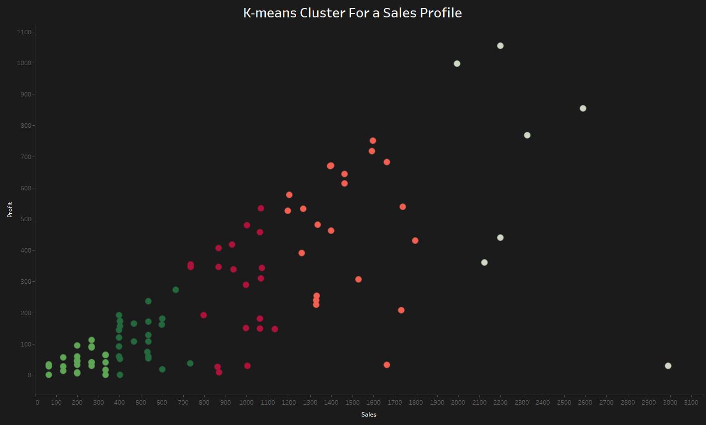

## K-means Cluster Algorithm using R and Tableau:

In this project, I am trying to explore the K-means algorithm coming with R base libraries and see how efficiently it could perform on a certain dataset for a sales profile. I then used Tableau to visualize the result on a color-graded scatter plot.

